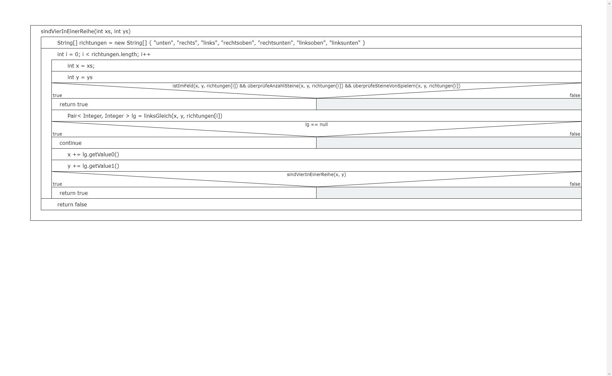
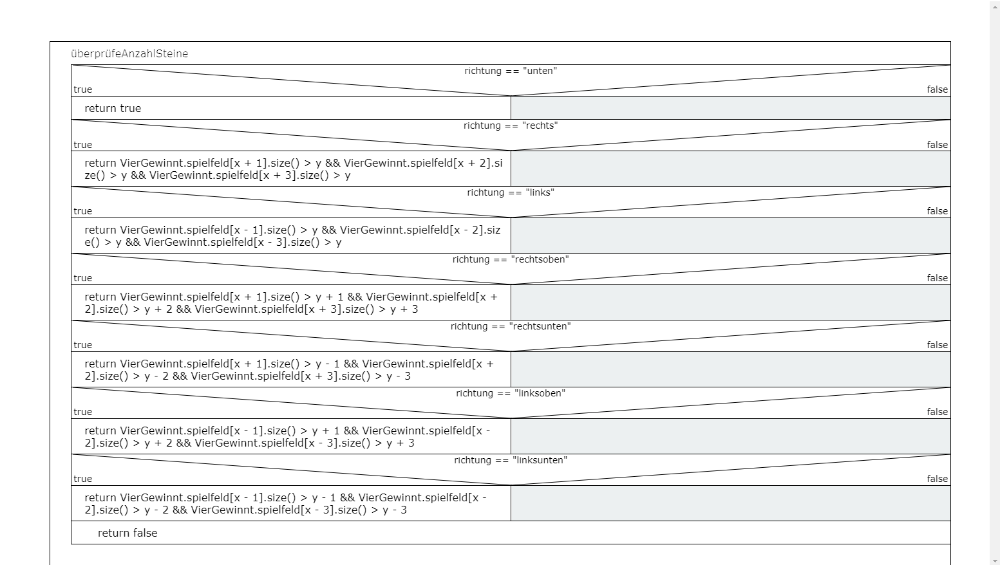
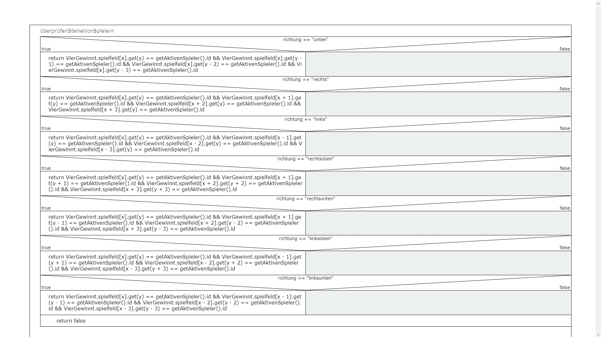
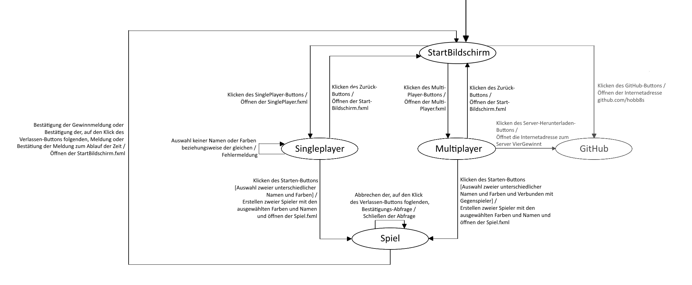
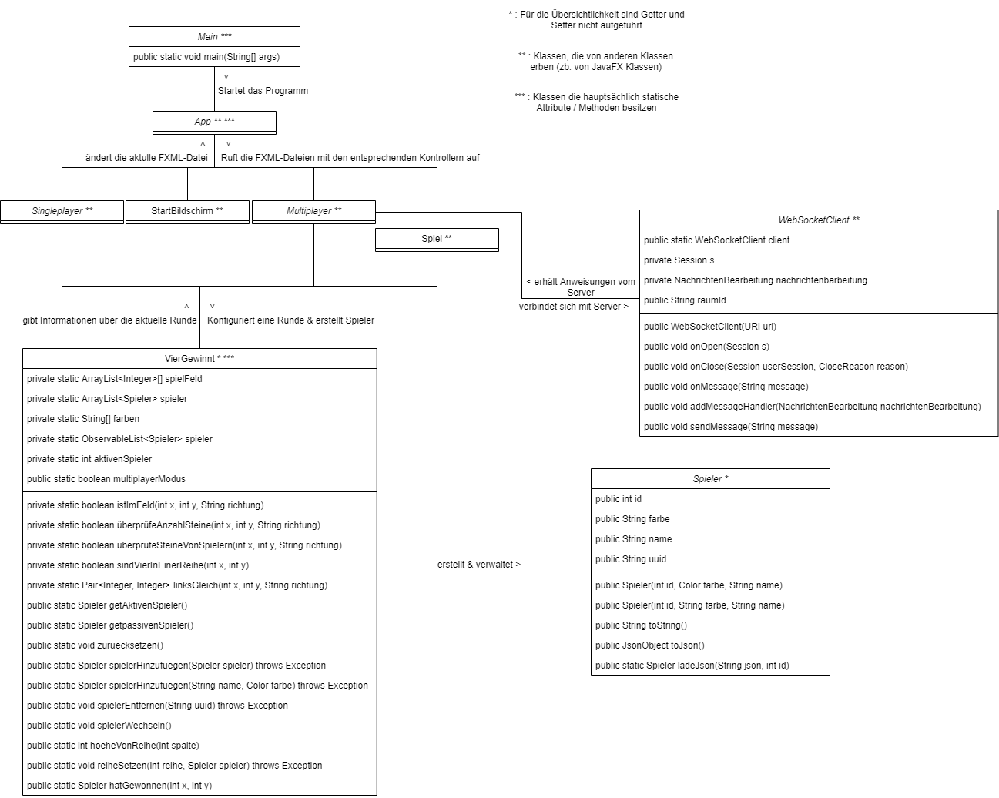

# Entwicklerdokumention

## Allgemein

Das Projekt besteht aus 3 Programmen:

#### Viergewinnt

Dieses Progamm ist das eigentliche Spiel in dem man ohne Internet mit einer anderen Person spielen kann auf dem gleichen Gerät speilen kann.  
(Vollständig in Java programmiert)

#### Server

Mithilfe des Servers kann man online über das Viergewinnt-Spiel spielen.
(Vollständig in Typescript mit NodeJS/NodeTS programmiert)

#### Templater

Mit diesem Programm können Markdowntemplate-Dateien gerendert werden.  
Wird benutzt um die Links in der README.md aktuell zu halten.  
Das Programm ersetzt markierte Stellen mit ENV-Variablen (Umgebungsvaribalen).  
(Vollständig in Typescript mit Deno programmiert)  
  
Beispiel:  
| Template                               | ENV-Varibale | Gerendert                      |
| -------------------------------------- | ------------ | ------------------------------ |
| Die aktulle Version ist "{{version}}". | VERSION=1.0  | Die aktulle Version ist "1.0". |

## Struktogramme

Die Methoden der Struktogramme befinden sich in der Klasse Viergewinnt.

## Zustandsdiagramm

## Klassendiagramm

## Seqenzdiagramm

Da in unserem Projekt fast alle Klassen statisch genutzt werden, ergibt ein Sequenzdiagramm in unserem Projekt keinen Sinn.