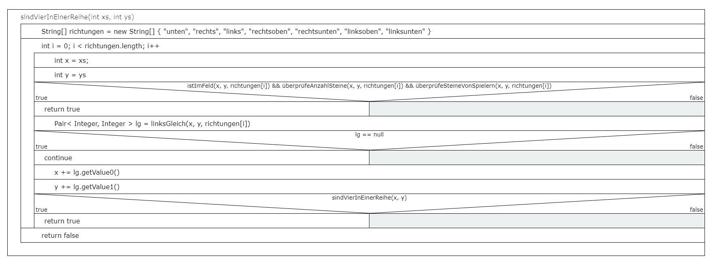

# Entwicklerdokumention

## Empfolenen Systemanforderungen

|               | Singelplayer                      | Multiplayer                       |
| ------------- | --------------------------------- | --------------------------------- |
| Betriebsystem | Windows x64, Linux x64, MacOS x64 | Windows x64, Linux x64, MacOS x64 |
| CPU           | AMD Ryzen 3 1200                  | AMD Ryzen 3 1200                  |
| RAM           | 4 GB                              | 4 GB                              |
| Sontiges      | Java@16                           | Java@16, Internetverbindung       |

##  Diagramme

