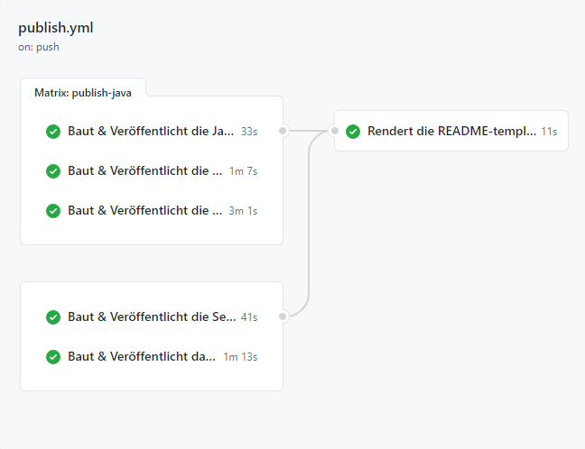

# Projektdokumentation

- [Projektdokumentation](#projektdokumentation)
  - [verschiedene Spielmodi](#verschiedene-spielmodi)
  - [Interaktion zwischen Server und Client](#interaktion-zwischen-server-und-client)
  - [Zeitlicher Verlauf](#Zeitlicher-Verlauf)
  - [Organisationsplan](#Organisationsplan)
  - [Entwurfsmethode](#Entwurfsmethode)
  - [Aufgewandet Resourcen](#Aufgewandet-Resourcen)
  - [Github Workflow](#Github-Workflow)

##  verschiedene Spielmodi

Es gibt einmal einen Single-Modus, in dem man zu zweit auf einem Endgrät spielen kann.  
Der zweite Modus ist der Multiplayer, bei dem man über das Internet gegeneinander spielen kann.

##  Interaktion zwischen Server und Client

Websockets ist eine typische Web-Technologie

Alle Clients kommunizieren mit dem Server mithilfe des Websocket-Protokoll (ws://...:...). Zum Verbinden wird außerdem eine RaumID benötigt.  
Der Server kann unbegrenzt viele Verbindungen mit Clients aufbauen. Alle Verbindugen werden in Räumen organisiert mit einer eindeutigen RoomID.

Wenn der Server ein Event von einem Client empfängt, kann der Server eine Antwort zu allen Raummitgliedern senden.

##  Zeitlicher Verlauf

siehe: https://docs.google.com/document/d/1gLCbLlnt4DEFzWhaFuhY_BsMB7LpnkxaXVyn_-cFiX0/edit?usp=sharing

##  Organisationsplan

Das Projekt wurde in zwei Bereiche aufgeteilt, Robin und Moritz waren Designer, Felix und Paul haben die Spiellogik programmiert.

##  Entwurfsmethode

Wir haben das Wasserfallmodell benutzt. Allerdings wurde der erste Punkt sehr kurz gehalten, da unsere einzige Anforderung die Programmiersprache Java war.  
Somit sind wir schnell zum Entwurfsmuster übergegangen, haben unser Ziel definiert, erste grobe Skizzen erstellt und ein Klassendiagramm gezeichnet.  
Im dritten Schritt wurden unsere Vorschläge und Ideen implementiert. Testung und Integrierung waren danach an der Reihe.  
Als letztes wurde das Programm an Familie und Freunde verteilt, getestet und verbessert.  
Während allen Schritten haben wir Soll-Ist-Vergeleiche durchgeführt, um mögliche Abweichungen zu erkennen und zu vermeiden.  

Zum Schluss wurde die Projektdokumentation verfasst, die restlichen Diagramme erstellt und die Präsentation kreiert.  

##  Aufgewandet Resourcen

Programme:
- IntelliJ IDEA Community
- VS Code
- https://structorizer.com
- https://github.com/

Sprachen: 
- Java (Maven)
- JavaFX
- Cascading Style Sheets (CSS)
- TypeScript (Deno & NodeJS/NodeTS)
- Markdown
- YAML (GitHub Workflow)

##  Github Workflow

Wir haben GitHub Workflow benutz, um die Programme für alle Platformen zu bauen/kompilieren.  
Immer wenn ein neuer Releas erstellt wird, werden die Apps automatisch mit Hilfe von GitHub gebaut.  
